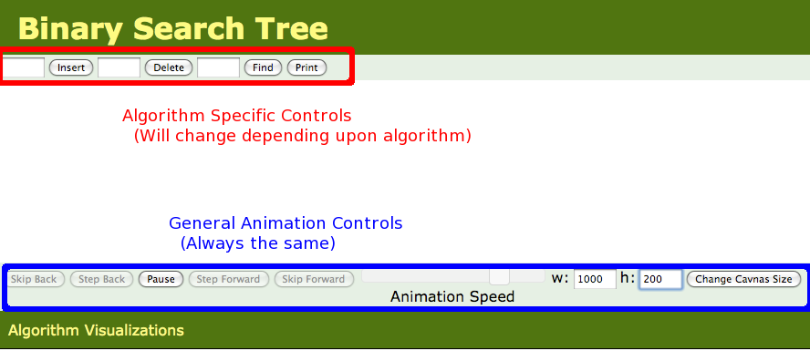

## Visualizing Algorithms

The best way to understand complex data structures is to see them in action. We've developed interactive animations for a 
variety of data structures and algorithms. Our visualization tool is written in javascript using the HTML5 canvas element,
and run in just about any modern browser  -- including iOS devices like the iPhone and iPad, and even the web browser in
the Kindle!  (The frame rate is low enough in the Kindle that the visualizations aren't terribly useful, but the tree-based 
visualizations -- BSTs and AVL Trees -- seem to work well enough)

Check the [Algorithms](../Index.html) menu for all of the latest javascript implementations.

## How to Use the Visualizations

This visualizations are meant to be fairly self- explainitory, though there are some subleties for advanced usage.   Take a look at a
typical visualization, for Binary Search Trees:

### Algorithm Specific Controls
At the top of the screen (boxed in red in the above screenshot) are the algorithm specific controls -- these will change depending upon
what algorithm you are visualizing.  In this example, you could insert, delete, or find an element in the BST by entering text in the
appropriate field and either pressing return or clicking the relevant button.  The tree can be printed by clicking the print button.  
Once you give a command, the visualiztion will start, and can be controlled by the general animation controls at the bottom of the screen.

### General Animation Controls

- *Skip Back* If you are in the middle of an animation, this button will completly undo the current command.  If you are 
not in the middle of an animation, this button will undo the previous command  
- *Step Back* This button is only active if you have paused the current animation (using the play/pause button).  Step back
one step in the current animation.  If you are not currently animating, step back into the previous command.  You could use this button
(with sufficient keypresses) to back up through the entire history of everything you've done  
- *Play/Pause* Toggle between play mode (in which the algorithm runs free until it completes) and paused mode (where you need to
press the Step Forward or Step Back button to advance the animation)  
- *Step Forward* This button is only active if you have paused the current animation (using the play/pause button), and the current
animation has not yet completed.  Step
forward one step in the current animation.  
- *Skip Forward* This button is only active if the current animation has not completed.  Skip to the end of the current animation
 
- *Animation Speed (slider)* Change the speed of the animation.  The value of this slider is saved in a cookie, so you should
only need to set it once if you have a preferred speed 
- *w, h, Chnage Canvas Size* Change the width / height of the display area.  While the change is immediate, the animations will
not be centered in this new field until you reload the page.  This will clear out the currnet animation, but the width and hight values 
are also saved in a cookie, so you should only need to change this field once, and then everything should work well if you are on
a smart phone or a desktop with loads of screen real estate.

- *Move Controls* Toggle between the general controls being at the top or bottom of the webpage    
   
   Note that it can be easy to confuse yourself by stepping forward an backwards through an animation -- you can confuse the <em>next**
   step in the animation with the **revious** step, and misunderstand how the algorithm works.  You may wish to only step
   forward when you are first delving into a particular algorithm.

## Writing your Own

 [The tutorial for creating your own visualizations is now online!](source.html)
All source code is available there as well.  If you want to create your own visualizations, but are having trouble
getting things to work, please let me know.  Everything is licensed under FreeBSD, and you
can use it for whatever you like.  Please let me know if you using the code -- I'm curious to see what
it does in the wild.

Copyright 2011 [David Galles](http://www.cs.usfca.edu/galles)